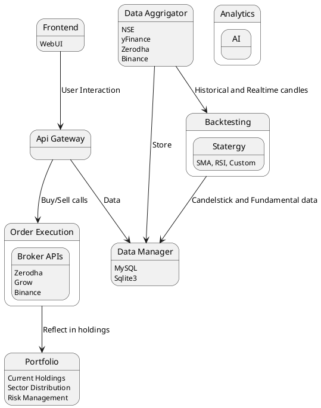

# Trend Buddy

An Open-Source Trading Companion for Analysis, Backtesting, and Automated Trading.

## About The Project

Trend Buddy is a comprehensive, open-source trading bot designed for developers and trading enthusiasts. It provides a modular framework for fetching market data, running backtests, executing trades, and managing portfolios. The project aims to incorporate AI-powered analytics to provide deeper insights into market trends.

## Features

-   **Technical Analysis:** Generate technical analysis pages similar to TradingView.
-   **Automated Trading:**
    -   Execute buy/sell calls based on TradingView signals.
    -   Support for partial buy/sell orders.
    -   Predictive stop-loss calculation.
-   **Strategy Management:**
    -   Utilize multiple indicators with customizable weights and priorities.
    -   Sector-specific macro analysis (e.g., IT, Pharma, Banking).
-   **Portfolio Management:**
    -   Import order history from brokers via CSV (e.g., Zerodha).
    -   Track overall and daily Profit & Loss with candlestick charts.
-   **Financial Tools:**
    -   SIP calculator with customizable parameters.
    -   Candlestick pattern detection across daily, weekly, and monthly timeframes.
-   **Backtesting & Optimization:**
    -   Run backtests on historical data for any time period.
    -   Optimize strategy parameters like RSI.
-   **AI-Powered Analytics:**
    -   Perform fundamental and sentiment analysis.

## Architecture

The system is designed with a modular, service-oriented architecture to ensure scalability and maintainability. A central API Gateway orchestrates communication between the user-facing frontend and the various backend services.

Here is a breakdown of the core components as depicted in the architectural diagram:

-   **Frontend (WebUI):** The graphical user interface where users can interact with the application, view portfolio performance, and configure strategies.

-   **API Gateway:** The single entry point for all frontend requests. It routes calls to the appropriate internal service, such as placing an order or fetching historical data.

-   **Data Aggregator:** This module is responsible for fetching data from multiple external sources, including:
    -   Stock exchanges (`NSE`)
    -   Financial data providers (`yFinance`)
    -   Broker APIs (`Zerodha`, `Binance`)
    It provides both historical and real-time data to the Backtesting engine and the Data Manager.

-   **Data Manager:** The persistence layer of the application. It uses databases like `MySQL` and `Sqlite3` to store all candlestick data, fundamental data, and user portfolio information.

-   **Backtesting Engine:** Enables users to test trading strategies (e.g., SMA, RSI, Custom) against historical data provided by the Data Manager.

-   **Order Execution (OE):** Manages the lifecycle of buy and sell orders. It interfaces with various broker APIs (`Zerodha`, `Groww`, `Binance`) to execute trades and then updates the Portfolio module.

-   **Portfolio Manager:** Tracks current holdings, monitors sector-wise portfolio distribution, and helps in managing risk.

-   **Analytics Engine:** An AI-powered module dedicated to performing advanced analysis, such as fundamental and sentiment analysis, to provide deeper market insights.

View Architecture Diagram (PlantUML)

## Technology Stack

### Data Fetching
- [yfinance](https://github.com/ranaroussi/yfinance)
- [Alpha Vantage](https://www.alphavantage.co/documentation/) (Planned)

### Charting & Visualization
- [Lightweight Charts](https://github.com/tradingview/lightweight-charts)

### Backtesting
- [VectorBT](https://github.com/polakowo/vectorbt)

## API References
- [Binance Spot API Docs](https://github.com/binance/binance-spot-api-docs)
- [Binance API Docs (Spot)](https://binance-docs.github.io/apidocs/spot/en/)
- [Binance Web Socket Streams](https://github.com/binance/binance-spot-api-docs/blob/master/web-socket-streams.md)
