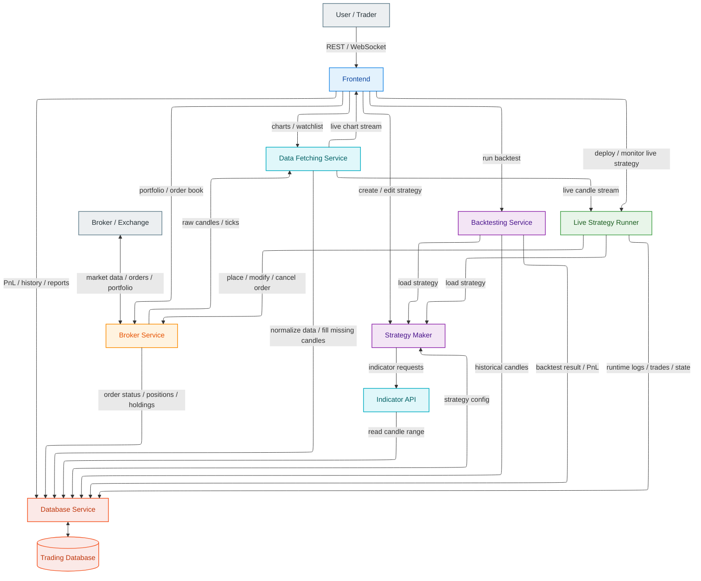

## Repository Shape

- `apps/web` contains the Vue frontend.
- `services/` contains deployable services, with Go used for online latency-sensitive services and Python used for research-heavy modules such as backtesting and analytics.
- `packages/go` and `packages/python` contain shared contracts, clients and platform helpers.
- `config/` owns tracked base env config plus generated local env files.
- `infra/compose` and `infra/docker` own container orchestration and shared Docker build definitions.

## Architecture Components

---
### 1. Data Ingestion Service

**Scope**
- Fetch historical candle/OHLCV data
- Manage broker/data-provider websocket streams
- Detect and fill missing candles/gaps
- Normalize raw market data into internal format
- Publish cleaned market data to downstream services

**Should not do**
- Indicator calculations
- Strategy logic
- Order placement
- Direct frontend handling

---
### 2. Broker Gateway Service

**Scope**
- Single integration point with broker APIs
- Fetch live market feed if broker provides it
- Place/modify/cancel orders
- Fetch portfolio, margin, positions, holdings, order status
- Normalize broker-specific responses into internal models

**Should not do**
- Strategy decisions
- Backtesting
- UI-facing business aggregation

---
### 3. Database Service

**Scope**
- Only point of contact with database
- Store/retrieve candles, trades, orders, positions, strategy configs, backtest results, live run logs
- Provide query APIs to internal services
- Handle schema, indexing, retention, consistency

**Should not do**
- Business logic
- Direct broker calls
- Direct frontend logic

---
### 4. Indicator Engine API

**Scope**
- Compute indicators on requested candle ranges
- Expose reusable math functions and indicator pipelines
- Return computed indicator series to strategy/backtest/frontend
- Stateless or cache-backed service

**Should not do**
- Fetch raw data from broker directly
- Store business entities
- Execute strategy logic

---
### 5. Strategy Engine / Strategy Maker

**Scope**
- Define strategies as compositions of indicators + rule logic
- Maintain strategy definition format/versioning
- Generate entry/exit/hold signals
- Support both backtesting and live execution reuse

**Should not do**
- Place orders directly
- Compute PnL directly
- Manage database access directly

---
### 6. Backtesting Service

**Scope**
- Run strategy on historical data for a given period
- Request candles from Database/Data service
- Request indicator values from Indicator API
- Apply fills, slippage, brokerage, fees
- Calculate PnL, drawdown, win rate, stats, trade logs

**Should not do**
- Live execution
- Broker order placement
- Maintain strategy definitions

---
### 7. Live Strategy Runner

**Scope**
- Deploy/start/stop/pause live strategies
- Subscribe to live candles/events
- Feed live data into Strategy Engine
- Convert signals into execution requests through Broker Gateway
- Track runtime state, live logs, health, risk checks

**Should not do**
- Indicator math ownership
- Historical bulk backtesting
- Frontend rendering

---
### 8. Portfolio & Analytics Service

**Scope**
- Aggregate portfolio PnL, holdings, exposure, performance metrics
- Serve homepage analytics
- Combine broker data + stored execution history
- Provide watchlist metrics and live strategy summaries

**Should not do**
- Execute orders
- Define strategies
- Compute indicators internally

---
### 9. Frontend Service / UI

**Scope**
- Communicate only through REST/WebSocket APIs
- Show dashboards, charts, strategy panels, order book, live strategies
- No direct DB or broker access

**Should not do**
- Business logic
- Strategy execution logic
- Indicator computation locally beyond simple chart overlays

---
### 10. API Gateway / MCP Layer

**Scope**
- Unified API entry point for frontend and AI probing
- Expose MCP-compatible APIs for all services
- Authentication, authorization, rate limiting, routing
- Standard service discovery and tool descriptions for AI

**Should not do**
- Core trading/business logic
- Data storage
- Direct indicator or strategy ownership

---

### Architecture Diagram

